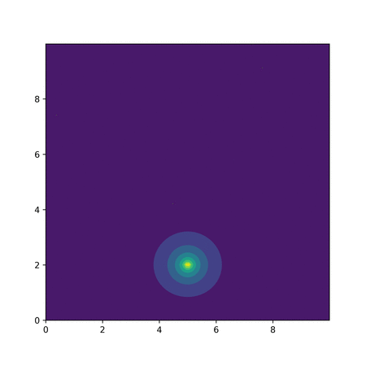

# Cell_Migration_DDPG

Preliminary results of paper "A deep deterministic policy gradient model for neural crest cell migration", which is currently under review.

Codes will be uploaded once the paper is published.

(***Left***) Neural crest cell follows the leader in a 'chase-run' mechanism. (***Right***) Concentration gradient field shows the effect of leader tail areas.

                     

